# claude-linkedin-audit

Audit your LinkedIn profile the way a recruiter reads it — then fix it, from Claude Code.

A Claude Code skill that captures your **live** LinkedIn profile with Playwright (using a login session that never leaves your machine), scores it against a 12-section recruiter-focused rubric, writes a prioritized report with concrete rewrites, and — after your explicit approval — applies the changes directly to your profile.



## What it does

- **Capture** — visits your profile plus every detail page (experience, education, skills, certifications, projects, recommendations, featured, volunteering, activity), expands "see more", and saves extracted text, full-page screenshots, and a URL manifest.
- **Score** — 12 sections, 0–10 each (120 total), against a rubric built on one principle: *a recruiter spends 6–10 seconds deciding whether your profile is worth more time.* Banner and photo are judged from the screenshots, not just text.
- **Report** — `REPORT.md` with a scorecard, top-5 actions ordered by impact, and for every finding a quote of what the profile says now plus the actual rewritten replacement — never "make it more specific".
- **Apply** — 15+ Playwright edit operations: headline, About, experience descriptions, skills (add + associate with positions), Top-skills showcase swaps, projects (rewrite + add), Featured (posts, links, deletes), certification reordering, open-to-work titles, and banner upload (with a deterministic HTML→PNG banner renderer). Every op screenshots before/after and is verified by re-capture.

The edit layer encodes months of hard-won LinkedIn DOM knowledge: shadow-DOM edit modals, server-side language flipping (all selectors are bilingual), lazy-loaded detail pages, silent no-op saves, and geometric button matching where aria-labels lie.

## Install

### Plugin marketplace (recommended)

```
/plugin marketplace add SilviuPad/claude-linkedin-audit
/plugin install linkedin-audit@silviupad-claude-linkedin-audit
```

### Manual (as a user-level skill)

```bash
git clone --depth 1 https://github.com/SilviuPad/claude-linkedin-audit.git
cp -r claude-linkedin-audit/skills/linkedin-audit ~/.claude/skills/
cd ~/.claude/skills/linkedin-audit/scripts && npm install
```

The capture script prefers your system Chrome/Edge. If neither is installed: `npx playwright install chromium`.

## How to use

### 1. Start an audit

In any Claude Code session, either invoke the skill directly or just ask in plain language:

```
/linkedin-audit
```

```
audit my LinkedIn profile
```

On the **first run** it will:

1. Ask for your profile URL and target role (saved to `config.json` so it never asks again).
2. Open a **visible** browser window — log in to LinkedIn manually, once. The session is stored in `.browser-profile/` inside the skill directory and reused on every later run.
3. Capture your profile and all detail pages, score every section, and write the report.

Later runs skip straight to capture: no questions, no login.

### 2. Read the report

Everything lands in `audits/<date>/` inside the skill directory:

- `REPORT.md` — the scorecard (12 sections, 0–10 each), the top-5 actions ordered by impact, and for every finding a quote of the current text plus a ready-to-paste rewrite.
- `screenshots/` — full-page captures of your profile and each detail page (banner and photo are scored from these).
- `extracted/` + `manifest.json` — the raw text and URLs the scores are based on, if you want to check the receipts.

### 3. Apply fixes (optional, always with approval)

Tell Claude which findings to act on:

```
apply the top 3 actions from the report
```

```
rewrite my headline and About the way the report suggests
```

Claude drafts a change set (`CHANGES.md` + `changes.mjs`) and shows you the **exact final text** — nothing touches your profile until you approve it. Then `edit-profile.mjs` applies the operations, screenshotting before/after each one and verifying by re-capture.

### 4. Verify

```
re-run the audit and compare with the last one
```

A fresh capture confirms the edits stuck (LinkedIn sometimes no-op-saves silently — the verify step exists exactly for that) and shows the score delta.

### Example prompts

| You say | What happens |
| --- | --- |
| `audit my LinkedIn profile` | full capture → score → `REPORT.md` |
| `just re-capture, don't re-score` | refresh the raw capture only |
| `apply the top 3 actions` | drafts a change set for the highest-impact findings |
| `add the missing skills and pin the right top 3` | skills add + Top-skills showcase swap |
| `generate and upload a new banner` | renders a 1584×396 banner deterministically, uploads it |
| `re-run the audit and compare` | fresh audit + before/after score diff |

## Privacy & responsible use

- Your login session, captures, and reports stay in the skill directory on your machine. Nothing is sent anywhere.
- The skill audits **your own profile** (or one you explicitly manage) — one profile per run. It is not a scraping tool; don't point it at other people's profiles.
- Browser automation of LinkedIn may conflict with LinkedIn's Terms of Service. You're driving your own logged-in browser at human speed, but use it at your own discretion and risk.

## Repository layout

```
.claude-plugin/          marketplace.json + plugin.json
skills/linkedin-audit/
  SKILL.md               the skill: workflow, rubric pointers, edit-op reference
  references/
    audit-criteria.md    the full 12-section scoring rubric
  scripts/
    capture-profile.mjs  Playwright capture (profile + 9 detail pages)
    edit-profile.mjs     15+ edit operations with verify + screenshots
    render-banner.mjs    deterministic 1584×396 banner rendering
  examples/
    changes.example.mjs  template change set for edit-profile.mjs
  config.example.json    profile URL + target role template
assets/                  animated architecture diagram
```

## Runtime artifacts (never committed)

`config.json`, `.browser-profile/` (your session), `audits/` (your captures and reports), and `node_modules/` are created at runtime inside the skill directory and are gitignored.

## License

MIT
